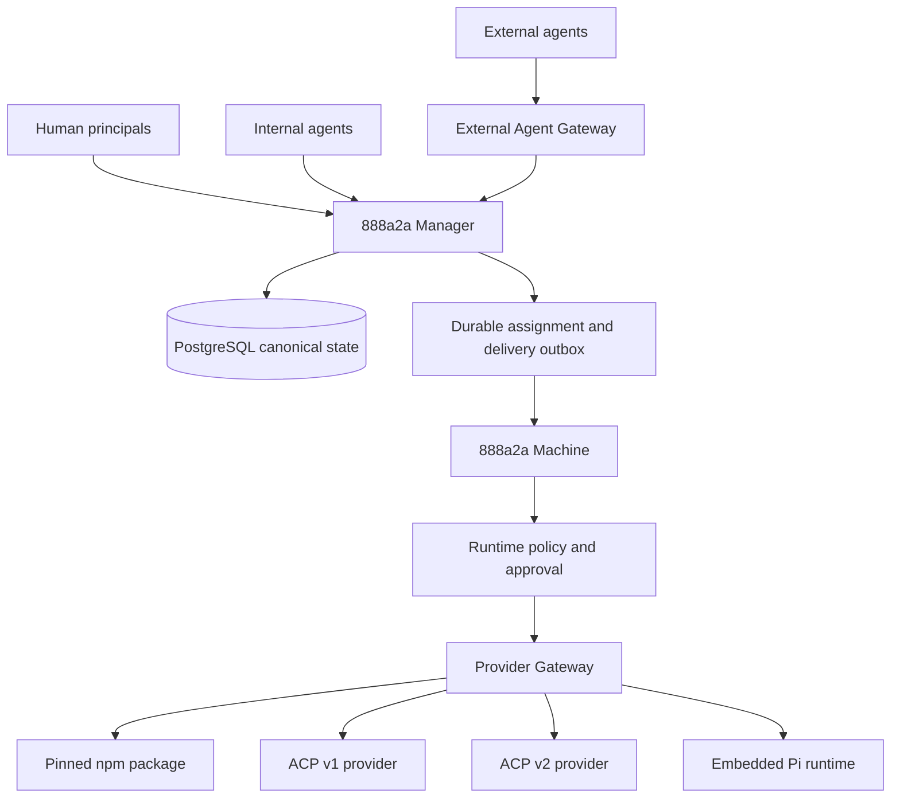

# Spec: 888a2a Downstream Fork 與本機 Provider Gateway

- 狀態：Draft，等待人工審核
- 方法：Spec-Driven Development（Specify → Plan → Tasks → Implement）
- 適用版本：888a2a `main`，基準 commit `e31246bb3c5559ff48abd219e80059ddbfbd73b2`

> 本文件完成 Specify、Plan 與 Tasks。未經人工核准，不進入 Implement。

## 1. 決策摘要

以 888a2a 作為多人類、多 Agent 協作與 Agent 執行的主核心，建立長期 downstream fork。新產品保留 Manager／Machine 架構，在 Machine 增加 VOKO 類型的本機 Provider Gateway，支援受控的 npm／`npx` runtime、ACP v1、ACP v2 與後續 Provider adapter。

AgentIM 不作為主要訊息核心。選擇性移植其 Ed25519 challenge-response、短期 JWT、credential revoke 與 WebSocket listener 設計，作為未來 External Agent Gateway 的基礎。

上游合作採選擇性 PR：通用、低耦合、可獨立驗證的改善回饋 `Ranxy/888a2a`；產品方向、外部 Gateway、多租戶和大規模資料模型變更保留在 downstream fork。

## 2. 假設

1. 888a2a 的主要使用者是同一組織內的多位人類與多個長期存在的 Agent。
2. Manager 繼續負責協作控制平面、IAM、訊息、任務、審計與排程。
3. Machine 繼續負責執行平面，一台 Machine 可同時託管多個 Agent。
4. PostgreSQL 維持為 Manager 的主要資料庫。
5. Provider package 在 Machine 本機執行，不把 API key、工作區或 session 交給外部雲端 runtime 管理。
6. 正式環境禁止未固定版本的 npm package；`@latest` 只允許在明確的開發模式使用。
7. AgentIM 的設計以 Go 原生方式整合到 888a2a；預設不引入 Rust sidecar 或第二套 canonical message store。
8. 下游產品會保留 Apache-2.0 授權文字、原始 attribution 與修改聲明。

若上述假設改變，先更新本文件，再修改程式。

## 3. Objective

建立一個完整自託管的人類與 Agent 協作平台，使多位人類及多個位於不同 Machine 的 Agent 能在相同 Channel、DM、Thread 與 Task 中工作。Agent 保有獨立 workspace、persona、session 與安全邊界，並能透過標準 Provider Gateway 接入不同本機 Coding Agent。

### 3.1 使用者

- Workspace admin：管理使用者、Machine、Agent、Provider、runtime policy 與稽核。
- Workspace member：在 Channel、DM、Thread 和 Task 中與人類及 Agent 協作。
- Agent owner：設定自己的 Agent，核准高風險操作並查看執行紀錄。
- Agent：讀取訊息、認領任務、委派其他 Agent、執行工具並回報結果。
- 外部 Agent：未來透過 External Agent Gateway 使用密碼學身分接入有限範圍的對話或 Task。

### 3.2 成功結果

- 888a2a 既有多人、多 Agent 協作功能持續可用。
- Machine 能以統一 manifest 安裝、檢查和啟動固定版本的 npm Provider。
- Provider session 能持久化、resume，失敗時不遺失 Manager 中的訊息。
- 所有高風險工具操作經過後端 policy 決策，不能只依賴 prompt。
- 外部 Agent 身分可以在不改變 canonical message store 的前提下加入。
- downstream fork 可持續同步上游的小型修正。

## 4. Scope

### 4.1 第一階段範圍

- Downstream fork 與 upstream 同步策略。
- 現有 Provider interface 的 capability 化。
- 本機 npm／`npx` Provider 安裝、快取、偵測、啟動與健康檢查。
- ACP v1／v2 session resume 與 Provider compatibility harness。
- Machine assignment 的可靠投遞。
- 結構化 permission policy 與 human approval gate。
- Provider 執行、工具呼叫、安裝與升級的審計事件。

### 4.2 後續範圍

- Ed25519 Agent credential。
- 短期 JWT、challenge、revoke 與 key rotation。
- External Agent WebSocket listener。
- A2A 1.0 Agent Card、Task mailbox、REST/Webhook Gateway。
- 多 Workspace／多租戶隔離。

### 4.3 Non-goals

- 不直接 fork 或嵌入 VOKO 未開源的雲端服務。
- 不以 AgentIM SQLite 取代 888a2a PostgreSQL。
- 不在第一階段追求 17 個 Provider。
- 不允許 Provider 在未受控狀態取得整台 Machine 的權限。
- 不建立另一套與 888a2a Channel、DM、Thread 平行的訊息真相來源。
- 不保證所有 Provider 擁有相同的 session、tool trace 或 steering 能力。

## 5. Tech Stack

- Backend：Go 1.26.4。
- API：ConnectRPC 1.20、Protobuf、buf。
- Agent protocol：ACP v1（`github.com/coder/acp-go-sdk` 0.13.5）與現有 ACP v2 thread client。
- Database：PostgreSQL。
- Frontend：React 19.2、TypeScript 5.9、Vite 8、Tailwind CSS 4。
- Machine npm runtime：Node.js 24；Docker image 目前以 Node 24.12 為基底。
- Package manager：npm／`npx`，Provider package 必須固定版本與完整性資訊。
- External identity：Ed25519；token 採短期 JWT，細節在 External Agent Gateway 階段定案。

## 6. Commands

### 6.1 Backend

```bash
gofmt -w <modified-go-files>
golangci-lint run --fix --allow-parallel-runners
golangci-lint run --allow-parallel-runners
go test ./backend/agent/provider ./backend/agent/chattools ./backend/manager/store ./backend/manager/api/v1 ./backend/agent/executor
go build -ldflags "-w -s" -p=16 -o ./build/888a2a ./backend/manager/bin/server/main.go
```

修改 ACP stdio runtime 時追加：

```bash
A2A888_RUN_OPENCODE_ACP_TESTS=1 go test ./backend/agent/executor -count=1
```

修改 ACP v2／Codex thread path 時追加：

```bash
A2A888_RUN_CODEX_ACP_TESTS=1 CODEX_HOME=<writable-codex-home> go test ./backend/agent/executor -run TestThreadExecutorCodex -count=1
```

### 6.2 Frontend

```bash
pnpm --dir frontend biome:check
pnpm --dir frontend lint --fix
pnpm --dir frontend biome:lint
pnpm --dir frontend type-check
pnpm --dir frontend test
```

### 6.3 Proto

```bash
buf format -w proto
buf lint proto
cd proto && buf generate
```

### 6.4 End-to-end

```bash
scripts/test-server.sh run --workdir /tmp/888a2a-provider-gateway-test
scripts/test-server.sh stop --workdir /tmp/888a2a-provider-gateway-test
```

## 7. Project Structure

現有目錄維持責任邊界：

```text
backend/agent/provider/          Provider 定義、偵測、capability、事件轉換
backend/agent/executor/          ACP v1／v2 執行與 session lifecycle
backend/agent/client/            Machine 與 Manager 的 data plane
backend/agent/home/              Machine／Agent 本機持久資料根目錄
backend/manager/component/       Dispatcher、IAM、MCP、排程等控制平面
backend/manager/api/v1/          Manager RPC handlers
backend/manager/store/           PostgreSQL store
backend/manager/migration/       Schema migration
proto/v1/v1/                     對外 API contract
proto/store/store/               持久資料 contract
frontend/src/                    管理與協作 UI
docs/plan/                       SDD spec、technical plan、decision record
```

預計新增的責任邊界：

```text
backend/agent/provider/manifest.go       Provider manifest 與 validation
backend/agent/provider/npm_runtime.go    npm package 安裝、快取與 local-bin resolution
backend/agent/provider/catalog.go        內建 Provider catalog
backend/agent/provider/compat/           Provider compatibility harness
backend/manager/component/approval/      結構化 human approval workflow
backend/manager/component/outbox/        Machine assignment／Gateway durable delivery
```

實作時可依既有 package 邊界調整檔名；不得把 npm install、permission policy 和訊息處理集中到單一大型檔案。

## 8. Architecture



### 8.1 Source of truth

- Manager PostgreSQL 是 conversation、message、thread、task、reminder、IAM 與 audit 的唯一真相來源。
- Machine 本機只保存 Provider package、runtime state、workspace、session ID 與可重建快取。
- Provider session 儲存失敗可以造成冷啟動，不能造成訊息遺失。
- External Gateway 不保存另一份永久 conversation history；必要的 delivery state 使用 outbox／inbox bridge table 並可追溯回 Manager resource。

## 9. Functional Requirements

### FR-1 Downstream 與 Upstream 治理

- Downstream repository 的 `origin` 指向 888a2a 產品倉庫，`upstream` 指向授權歸屬所記錄的上游來源。
- Downstream 維護自己的 release、image、migration 與 roadmap。
- 每個 upstream PR 必須可獨立測試，且不依賴 downstream 品牌或未合併功能。
- 大型方向先建立 upstream RFC issue；downstream 開發不等待 RFC 結果。

適合 upstream PR：

- 跨平台 bug fix。
- 測試、lint 與文件修正。
- 通用 Provider interface 改善。
- 固定版本的 npm Provider 支援。
- Machine assignment 可靠性修正。
- 無產品耦合的安全修正。

保留 downstream：

- External A2A Gateway。
- 多租戶。
- Provider marketplace 與商業 catalog。
- 大規模 UI／品牌調整。
- 破壞性 Proto／資料模型改造。

### FR-2 Provider Manifest

每個 Provider 必須宣告：

- 穩定 `id` 與顯示名稱。
- runtime 類型：`embedded`、`system`、`npm` 或 `custom`。
- protocol：ACP v1、ACP v2 或明確的 fallback 模式。
- 支援平台與架構。
- package／executable、固定版本、binary name 與完整性資訊。
- detect、install、probe、launch、health check 行為。
- model discovery、session resume、steering、MCP、tool trace 等 capability。
- permission profile 與預設工具政策。
- compatibility test status。

概念範例：

```yaml
id: claude-code
display_name: Claude Code
runtime:
  kind: npm
  package: "@agentclientprotocol/claude-agent-acp"
  version: "<pinned-version>"
  binary: "claude-agent-acp"
  integrity: "sha512-..."
protocol: acp-v1
capabilities:
  session_resume: true
  model_discovery: true
  tool_traces: true
permissions:
  profile: owner-approved-write
```

### FR-3 本機 npm／`npx` Runtime

- Machine 在安裝階段下載 package；Agent turn 執行時使用已安裝的 local binary。
- package 存放於 Machine data root 下的獨立 runtime cache，不寫入專案 repository。
- 相同 package、version、integrity 可共用不可變安裝結果。
- Agent 執行環境仍維持獨立 workspace、session 與 custom env。
- 安裝、升級、移除與 quarantine 皆需可觀測及可審計。
- 正式環境拒絕 `@latest`、未固定 semver、缺少 integrity 或未在 allowlist 的 package。
- npm lifecycle scripts 預設禁止；需要 lifecycle script 的 Provider 必須在 manifest 明確宣告並通過人工核准。
- runtime 啟動期間預設不允許隱式下載或自動更新。

Provider runtime 狀態至少包含：

```text
UNAVAILABLE → INSTALLING → READY
                    ├── BROKEN
                    └── QUARANTINED
READY → UPDATE_AVAILABLE → INSTALLING
```

### FR-4 Capability 與相容性

- UI 只顯示 Provider 實際 probe 成功的 capability。
- Provider 缺少 resume 時，系統明確標示 cold-start 行為。
- Provider 缺少 steering、MCP 或 tool trace 時，不模擬不存在的功能。
- 每個內建 Provider 必須有 fake protocol test 與 opt-in real runtime integration test。
- compatibility report 記錄 OS、architecture、Provider version、驗證時間、已通過功能與限制。

### FR-5 Session 與可靠投遞

- Session fingerprint 繼續包含 Provider、model、working directory、protocol 與 persona。
- Provider package version 或 launch contract 改變時，session 必須失效或通過明確的相容遷移。
- Machine assignment/config/remove 使用 durable outbox，具有 sequence、ack、retry、replay 與冪等鍵。
- Machine reconnect 時重播未 ack 事件，再進行完整 roster reconciliation。
- Agent 離線時訊息留在 Manager；Provider 恢復後由現有 cursor／drain loop 繼續處理。

### FR-6 Runtime Security 與 Approval

- ACP permission request 不能無條件自動允許。
- 每個 tool action 先轉換成結構化風險資料：actor、requester、conversation、tool、target、effect、risk level。
- Policy engine 決定 `allow`、`deny` 或 `require_approval`。
- Approval 綁定 command、tool call、參數摘要、requester、owner、有效期限與單次 nonce。
- 參數、workspace、Provider 或 tool call 改變後，舊 approval 不得重用。
- Shell、filesystem write、external network、secret access 與 MCP call 可分別設定政策。
- Provider 子程序必須使用最小 env allowlist，不能繼承 Manager secrets。
- 取消或 timeout 後必須終止 Provider 子程序及其 descendants。

### FR-7 External Agent Identity

此階段借鑑 AgentIM 的設計，不直接引入其 server：

- Agent 本機產生 Ed25519 key pair，private key 不上傳。
- 註冊只保存 public key、fingerprint、owner 與 credential state。
- 登入採 server nonce challenge；成功後簽發短期 access token。
- Credential 支援 revoke、rotate、reauth-required 與 audit event。
- Human principal 與 Agent principal 保持不同 resource type。
- External Agent 的 Channel／Task 權限仍由 888a2a IAM 決定。
- WebSocket listener 只負責事件推送；歷史查詢回到 Manager API。

### FR-8 Audit 與 Observability

以下事件必須寫入可搜尋 audit／runtime event：

- Provider detect、install、upgrade、remove、quarantine。
- Package name、version、integrity、Machine 與操作者。
- Session cold start、resume、resume fallback、eviction。
- Tool permission request、policy decision、approval、deny、timeout。
- Machine assignment delivery、retry、ack 與 reconciliation。
- External credential activate、challenge failure、revoke、rotate。

不得記錄 API key、private key、完整 secret value 或未脫敏的 auth token。

## 10. Non-functional Requirements

### 10.1 Security

- Provider package 是不受信任供應鏈輸入。
- 安裝與執行至少使用獨立目錄、最小 env、固定版本、integrity 驗證及政策閘門。
- 任何 external principal 預設沒有 workspace、Channel 或 tool access。
- 安全降級採 fail closed；訊息保留於 Manager，等待人工處理或 runtime 恢復。

### 10.2 Reliability

- Assignment/event delivery 至少一次，consumer 必須冪等。
- Manager 重啟、Machine 重連與 Provider crash 不能遺失 chat message 或 task state。
- Package install 中斷不能覆蓋上一個可用版本。
- 升級失敗要能 rollback 到前一個已驗證版本。

### 10.3 Portability

- Linux amd64、Windows amd64、macOS arm64 為第一級目標。
- 路徑驗證必須處理 macOS `/var` → `/private/var` 等 symlink canonicalization。
- Provider manifest 明確宣告不支援的平台，不允許靜默嘗試。

### 10.4 Maintainability

- 新增 Provider 不應修改 Proto。
- Provider-specific 參數不得散落在 executor、manager handler 和 UI。
- manifest validation、runtime installation、protocol execution 與 event mapping 分開測試。
- downstream 特有功能盡量位於獨立 package，降低同步 upstream 的衝突。

## 11. Code Style

Provider interface 保持小型、能力導向，Provider-specific 行為留在 adapter：

```go
type RuntimeProvider interface {
	ID() string
	Manifest() Manifest
	Detect(context.Context) (Detected, error)
	Prepare(context.Context, PrepareRequest) (PreparedRuntime, error)
	Launch(context.Context, LaunchRequest) (Process, error)
}
```

規則：

- Go 使用 `gofmt`，錯誤包含操作與 resource context。
- 未使用參數以 `_` 命名；使用 `any`，避免 `interface{}`。
- 公開 API 遵循現有 AIP、Protobuf naming 與 ConnectRPC pattern。
- 不在 loop 內使用 `defer`。
- React 延續現有 hooks、store、i18n 與 Biome 規則。
- 註解只保留安全邊界、協議限制與非顯而易見的決策。

## 12. Testing Strategy

### 12.1 Unit

- Manifest schema、version、integrity 與 platform validation。
- npm cache key、local binary resolution、atomic install／rollback。
- Provider capability mapping。
- Permission policy decision table。
- Approval binding、expiration、nonce 與 parameter mismatch。
- Ed25519 challenge、JWT expiry、revoke 與 replay rejection。

### 12.2 Integration

- Fake npm registry／fixture package，避免一般 CI 依賴公開 npm。
- Fake ACP v1／v2 server 驗證 session、resume、cancel、tool event。
- PostgreSQL outbox producer／consumer／ack／replay。
- Manager restart、Machine reconnect、Provider crash recovery。
- 兩位 human、三個 Agent、兩台 Machine 的消息與 task flow。

### 12.3 Real runtime opt-in

- 固定 Provider version，在受控 Machine 執行。
- 驗證 detect、install、initialize、session resume、tool trace、permission deny、cancel。
- 測試結果輸出 compatibility artifact，不把本機 credential 寫入 artifact。

### 12.4 Frontend

- Provider install／upgrade／broken／quarantined 狀態。
- Approval request、approve、deny、expired。
- Capability 不支援時的 UI disabled state。
- Machine reconnect 與 assignment retry 的操作狀態。

## 13. Boundaries

### Always do

- 先更新 spec，再擴張需求或改變 interface。
- 固定 Provider package version 與 integrity。
- 在提交前執行 AGENTS.md 規定的 format、lint、test、build。
- 所有 security decision 與 package mutation 留下 audit event。
- Schema、Proto 與 Provider contract 保持向後相容，除非已有核准 migration plan。
- 每個 implementation PR 連結本文件的 requirement 與 task。

### Ask first

- 新增 production dependency。
- 修改 PostgreSQL schema 或 Proto public API。
- 改變 Agent／Machine credential model。
- 啟用 npm lifecycle script。
- 增加 external network egress。
- 改變授權、品牌、repository 名稱或 release channel。
- 將 downstream-only 功能提交 upstream。

### Never do

- 執行未固定版本的 production Provider。
- 把 API key、JWT、private key、session cookie 寫進 Git 或 audit payload。
- 讓 Provider 子程序繼承 Manager 全部環境變數。
- 讓 prompt 成為唯一的高風險操作防線。
- 建立第二個 canonical message store。
- 為了通過 CI 移除失敗測試或放寬安全檢查。
- 未取得原作者同意便使用 888a2a 名稱暗示官方衍生版本。

## 14. Implementation Plan

### Phase 0：Fork 與基準穩定化

1. 建立 downstream repository、`upstream` remote、release naming 與同步規則。
2. 記錄基準 commit、完整 build/test 結果與已知平台問題。
3. 修正 macOS workspace root canonicalization 測試。
4. 建立 Provider compatibility report 格式。
5. 將可獨立合併的修正準備成小型 upstream PR。

Checkpoint：三個目標平台的核心單元測試可執行；downstream 可重現 build；沒有產品功能變更。

### Phase 1：Provider Manifest 與 npm Runtime

1. 定義 manifest schema、validation 與 capability model。
2. 將現有 OpenCode、Claude Code、Codex 映射為 manifest-backed Provider。
3. 建立固定版本 npm package installer 與不可變 cache。
4. 將 Claude Code 從 `@latest` 遷移到固定版本與 local binary launch。
5. 建立 install／upgrade／rollback／quarantine 狀態與 UI。
6. 建立 fake npm package 與 compatibility harness。

Checkpoint：乾淨 Machine 可安裝一個固定版本 npm Provider；第二次啟動離線使用 cache；integrity 不符時拒絕執行。

### Phase 2：可靠投遞與 Runtime Security

1. 為 Machine assignment 建立 durable outbox、ack 與 replay。
2. 增加 runtime action risk model 與 policy engine。
3. 將 ACP permission request 接到 policy／approval，移除無條件允許。
4. 建立 approval persistence、UI、expiry、deny 與 audit。
5. 強化 subprocess env、process tree cancellation 與 platform sandbox。
6. 完成 Manager restart／Machine reconnect／Provider crash 測試。

Checkpoint：所有高風險測試操作在沒有有效 approval 時被拒絕；assignment 在斷線重連後自動補送。

### Phase 3：Provider Matrix

1. 選定首批五個 Provider，按使用需求排序。
2. 每個 Provider 實作 detect、probe、launch、session、permission 與 fallback。
3. 建立各平台 real runtime opt-in CI／測試手冊。
4. 發布公開 compatibility matrix，區分 detected、functional、full-loop verified。
5. 建立 Provider 升級與 regression gate。

Checkpoint：至少五個 Provider 有固定版本、清楚限制與真機驗證結果。

### Phase 4：External Agent Gateway

1. 定義 external Agent resource、credential 與 IAM boundary。
2. 實作 Ed25519 activate、challenge、verify、revoke、rotate。
3. 實作 WebSocket listener 與 durable event cursor。
4. 將 external events 映射到既有 Conversation／Task。
5. 增加 rate limit、abuse control、audit 與 operator UI。
6. 評估並實作 A2A 1.0、REST/Webhook，兩者保持可選模組。

Checkpoint：外部 Agent 沒有本機 workspace 權限也能在授權 Channel 收發訊息；撤銷 credential 後立即失效。

### Phase 5：多租戶與產品化（獨立決策）

此階段需要新的 SDD spec。不得直接延伸本文件開始實作。

## 15. Tasks

### Gate A：核准本規格

- [ ] Task：人工審核假設、scope、security boundary 與 upstream 策略
  - Acceptance：所有 Open Questions 已回答，文件狀態改為 `Approved`。
  - Verify：review diff，確認沒有未記錄的產品假設。
  - Files：`docs/plan/888a2a-provider-gateway-fork-sdd.md`

### Phase 0 Tasks

- [ ] Task：建立 downstream／upstream Git 與 release policy
  - Acceptance：文件記錄 remote、branch、tag、sync 與 attribution 規則。
  - Verify：`git remote -v`、測試一次 upstream fetch 與無衝突 rebase rehearsal。
  - Files：`README.md`、`README_zh.md`、`docs/development/upstream-sync.md`、`LICENSE`

- [ ] Task：修正 macOS ACP root canonicalization
  - Acceptance：存在與不存在的 root 內路徑均通過；symlink escape 仍被拒絕。
  - Verify：`go test ./backend/agent/executor -run TestACPValidatePath -count=1`
  - Files：`backend/agent/executor/acp_executor.go`、`backend/agent/executor/acp_executor_test.go`

- [ ] Task：定義 Provider compatibility report
  - Acceptance：report 可表達 OS、version、capability、驗證層級與限制。
  - Verify：以現有三個 Provider 各填一份 fixture 並通過 schema test。
  - Files：`backend/agent/provider/compat/`、`docs/provider-compatibility.md`

### Phase 1 Tasks

- [ ] Task：新增 Provider manifest model 與 validation
  - Acceptance：未知 runtime、浮動版本、缺少 binary／protocol 會回傳明確錯誤。
  - Verify：`go test ./backend/agent/provider -run Manifest -count=1`
  - Files：`backend/agent/provider/manifest.go`、`backend/agent/provider/manifest_test.go`

- [ ] Task：將現有 Provider registry 接到 manifest
  - Acceptance：OpenCode、Claude Code、Codex 的偵測與 model probe 行為維持不變。
  - Verify：`go test ./backend/agent/provider -count=1`
  - Files：`backend/agent/provider/registry.go`、三個現有 Provider 檔案與相關測試

- [ ] Task：實作 npm runtime cache 與 atomic install
  - Acceptance：固定版本只安裝一次；中斷安裝不破壞目前 READY 版本。
  - Verify：fake registry integration test，包含 cache hit、integrity mismatch、rollback。
  - Files：`backend/agent/provider/npm_runtime.go`、`backend/agent/provider/npm_runtime_test.go`、`backend/agent/home/`

- [ ] Task：將 Claude Code 改為 pinned local binary
  - Acceptance：turn 啟動不呼叫 `@latest`，斷網後可從 cache 啟動。
  - Verify：provider unit test＋真實 ACP opt-in test。
  - Files：`backend/agent/provider/claudecode.go`、相關測試、Machine image pin 設定

- [ ] Task：新增 Provider runtime 狀態 API 與 UI
  - Acceptance：UI 能呈現 INSTALLING、READY、BROKEN、QUARANTINED、UPDATE_AVAILABLE。
  - Verify：Proto lint／generate、backend test、frontend test 與 type-check。
  - Files：先拆成 Proto／backend／frontend 三個獨立 tasks，每個 task 不超過約五個檔案

### Phase 2 Tasks

- [ ] Task：建立 Machine assignment durable outbox
  - Acceptance：create、config update、remove 都有 sequence、ack、retry、replay。
  - Verify：斷開 Machine、建立 Agent、重連後 runner 自動出現；重播不產生 duplicate runner。
  - Files：migration、store、dispatcher、Proto 分拆成多個小 task

- [ ] Task：定義 runtime risk model 與 policy decision table
  - Acceptance：read、write、shell、network、secret、MCP 各有明確預設決策。
  - Verify：table-driven unit tests 覆蓋 owner、non-owner、Agent、external Agent。
  - Files：`backend/manager/component/approval/`、相關 Proto

- [ ] Task：接管 ACP permission request
  - Acceptance：executor 不再無條件選擇 allow；deny／approval timeout 正確回傳 Provider。
  - Verify：fake ACP permission integration tests。
  - Files：ACP executor、approval client bridge 與測試，必要時拆分

- [ ] Task：完成 approval persistence 與 UI
  - Acceptance：approve、deny、expire、parameter mismatch 和 single-use 都可驗證。
  - Verify：store、API、frontend test；人工測試 owner approval flow。
  - Files：migration／store／API／frontend 分成獨立 tasks

### Phase 3 Tasks

- [ ] Task：選定首批五個 Provider
  - Acceptance：每個 Provider 有使用需求、license、平台、protocol、安全與測試資訊。
  - Verify：人工核准 compatibility backlog。
  - Files：`docs/provider-compatibility.md`

- [ ] Task：逐一新增 Provider adapter
  - Acceptance：每個 adapter 皆有 manifest、unit、fake protocol、real opt-in test 與文件。
  - Verify：依 Provider 執行完整相容性檢查。
  - Files：每個 Provider 一個 focused task，控制在約五個檔案內

### Phase 4 Tasks

- [ ] Task：撰寫 External Agent Gateway 獨立 API spec
  - Acceptance：identity、credential、IAM、message mapping、rate limit、audit 均有契約。
  - Verify：人工核准後才開始 Proto／schema 實作。
  - Files：`docs/plan/external-agent-gateway-sdd.md`

## 16. Risks

| Risk | Impact | Mitigation |
|---|---|---|
| npm package supply-chain compromise | Machine 被執行惡意程式 | 固定版本、integrity、allowlist、quarantine、最小權限 |
| Provider CLI 頻繁破壞相容性 | session 或 tool trace 中斷 | compatibility harness、版本 pin、分階段升級、rollback |
| downstream 與 upstream 快速分歧 | rebase 成本升高 | 隔離 downstream package、小型 upstream PR、固定同步節奏 |
| 大型 PR 無法被上游審核 | 工作停滯 | downstream 自主發版；upstream PR 保持小型與中立 |
| prompt injection 觸發高風險工具 | 檔案、secret 或外部系統受損 | 後端 policy、approval binding、sandbox、audit |
| 第二套 Gateway 造成資料不一致 | 訊息、已讀、membership 分裂 | PostgreSQL canonical state；Gateway 只做 transport bridge |
| 多平台路徑與 process 行為不同 | Windows／macOS runtime 不穩定 | 每平台真機測試、明確 compatibility matrix |
| Provider 授權限制 | 無法重新散布 package | 逐 Provider license review，只分發允許的 metadata／installer |

## 17. Success Criteria

### Milestone A：安全的本機 Provider Gateway

- 所有內建 npm Provider 使用固定版本與完整性驗證。
- turn 啟動不會隱式下載或更新 package。
- 一個新 npm Provider 可只透過 manifest＋adapter 加入，不修改 public Proto。
- Linux、Windows、macOS 均完成至少一個 npm Provider 的啟動驗證。
- compatibility report 清楚區分 detect、functional、full-loop verified。

### Milestone B：可靠且受治理的協作

- Machine assignment 斷線重連後自動補送。
- ACP permission 不再無條件允許。
- 高風險操作沒有 approval 時必定失敗。
- approval 與實際 tool call 參數不一致時必定失效。
- Manager restart、Machine reconnect、Provider crash 不遺失訊息或 task state。

### Milestone C：External Agent Gateway

- External Agent private key 不離開其本機。
- Credential revoke 後既有 token 在政策要求的時間內失效。
- External Agent 只能讀寫 IAM 授權的 Conversation／Task。
- WebSocket 斷線後可透過 cursor 補讀，沒有只存在記憶體的唯一訊息。
- Gateway 關閉不影響內部 Human／Agent 協作。

## 18. Open Questions

1. 第一批五個 Provider 的優先順序為何？建議從現有 OpenCode、Claude Code、Codex，加上兩個具明確 ACP／headless 入口者開始。
2. npm Provider 的 package allowlist 由 workspace admin 管理，或由 release 內建、管理員只能選擇？
3. 正式環境是否一律禁止 npm lifecycle scripts，或允許經簽章 manifest 明確開啟？
4. Approval 的第一版是否只保護非 owner 請求，或連 owner 的 destructive action 也必須二次確認？
5. External Gateway 以 A2A 1.0 為標準時，需要哪些 888a2a extension？
6. 首個 release 是否要求完整 Windows／macOS 支援，或先以 Linux production、其他平台 preview 發布？
7. 哪些通用模組預計主動送 upstream PR？

## 19. Reference

- Upstream source：以 Git remote 與 repository `LICENSE` 記錄為準
- VOKO local runtime：https://github.com/laoyudashu/voko
- VOKO npm package：`@voko/lite`
- AgentIM：https://github.com/Xiamu-ssr/AgentIM
- 888a2a license：Apache-2.0，見 repository root `LICENSE`
