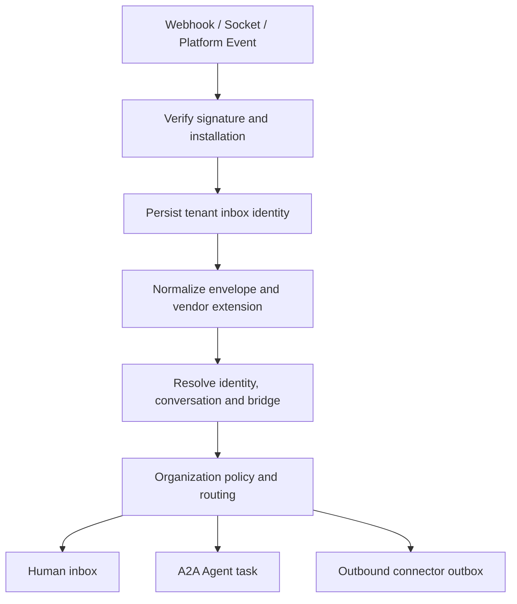

# 888a2a Omnichannel Human＋Agent Collaboration SaaS 規劃

> 目標：把 888a2a 發展成可商業化的多租戶協作平台。每個組織可以帶入真人團隊、內部 Bot、外部 A2A Agent、本機 Coding Agent，以及 Slack、Teams、LINE、WhatsApp、Web Widget 等入口，在相同的 Organization／Workspace 內協作並接受權限、Approval、稽核與用量治理。

[TOC]

> [!IMPORTANT]
> 這是一個平台級產品願景，範圍接近「組織協作 IM＋Omnichannel Inbox＋A2A Orchestrator＋Agent Runtime Gateway＋SaaS IAM」。方向一致，但必須用垂直切片分期，不能把所有通路與 Provider 放進第一版。

## 1. 產品定位

正式產品定位：

> **888a2a — 多租戶 Omnichannel Human＋Agent Collaboration Platform**

組織可以：

- 邀請真人團隊並建立 Workspace、Group、Role、Channel。
- 建立內部 888a2a Agent／Bot 或接入外部 A2A Agent。
- 透過 A2A 1.0 讓兩個或大量 Agent 交換 Task、Message、Artifact 與進度。
- 透過 ACP v1/v2、固定版本 npm／`npx`、MCP 接入 Codex、Claude Code、OpenCode、Pi 等本機 runtime。
- 接收 Slack、Teams、LINE、WhatsApp、Web Widget 的使用者訊息。
- 將外部對話交給真人、單一 Agent 或多 Agent 團隊處理。
- 依 Organization 設定 Approval Policy、審核群組、quorum、時效與升級規則。
- 追蹤 Agent、Machine、Connector、A2A、Token、儲存與訊息用量，預留組織收費能力。

### 1.1 Product Identity

- 產品名稱：`888a2a`。
- 平台內 Agent 名稱：`888a2a Agent`。
- Shell-safe 環境變數 prefix：`A2A888_`。
- CLI、Go module、Proto、資料目錄、Docker image、release artifact、service、cookie、metric、permission、UI 與文件全部納入 rename migration。
- 舊識別只允許存在於 migration mapping 與必要的 license／source attribution；新介面不得再輸出舊名稱。

## 2. 建議總架構

```text
  Slack   Teams   LINE   WhatsApp   Web Widget   Native Web
    │       │       │        │          │            │
    └───────┴───────┴────────┴──────────┴────────────┘
                            │
                   Connector Gateway
             驗簽、去重、限流、格式轉換、重試
                            │
                            ▼
                   Collaboration Plane
          Organization / Workspace / Conversation
           Human / Agent / Group / IAM / Approval
                            │
               ┌────────────┴────────────┐
               ▼                         ▼
          IM Message Plane          Agent Work Plane
            WuKongIM                   A2A 1.0
       排序、離線、多裝置         Task、Artifact、Streaming
               │                         │
               │                  Multi-Agent Orchestrator
               │                  Fan-out / Join / Budget
               │                         │
               └────────────┬────────────┘
                            ▼
                     Runtime Gateway
                 ACP v1/v2 / npx / MCP
            Codex / Claude / OpenCode / Pi
```

### 2.1 五個平面

| 平面 | 責任 | 不負責 |
|---|---|---|
| Connector Gateway | 外部平台安裝、驗簽、去重、事件正規化、rate limit、retry、outbound delivery | 組織 IAM、Agent 執行 |
| Collaboration Plane | Organization、Workspace、Principal、Channel、Task、IAM、Approval、Audit | IM 分散式排序、Provider protocol |
| IM Message Plane | per-channel sequence、idempotency、realtime、offline、多裝置、presence | A2A Task、組織政策 |
| Agent Work Plane | A2A Agent Card、Task、Message、Artifact、stream、push | 本機工具與 Provider process |
| Runtime Gateway | ACP、npm／npx、MCP、session、workspace、tool policy | 人類 IM、外部通路帳號 |

## 3. 為什麼不能只用 888a2a 現有 Chat API

888a2a 現有 Chat 已具備 Channel、DM、Thread、Mention、附件、Reaction、Task、Reminder、`room_version`、read cursor 與 long polling，適合自託管 MVP。

大型 SaaS 仍缺少：

- `client_msg_no` 冪等。
- 全域訊息 ID＋per-channel sequence 的完整模型。
- 編輯、撤回、redaction 與 moderation event。
- 多裝置與離線同步。
- Presence、typing、delivery/read receipts。
- 大群 fan-out、hot channel partition、backpressure。
- 多實例 realtime notifier。
- Durable notification、dead-letter、replay、reconciliation。
- Retention、legal hold、export、compliance deletion。

因此採用成熟 IM engine。WuKongIM 是目前的優先候選：Go、Apache-2.0，並提供 per-channel ordering、`client_msg_no`、離線同步、多裝置、presence 與分散式 Channel runtime[^wukong]。

> [!WARNING]
> WuKongIM v3 目前仍標示 Beta。正式選型前必須完成排序、failover、瀏覽器 reconnect、備份還原、升級、hot channel 與 subscriber reconciliation spike。Message Plane 必須保留 adapter 邊界。

## 4. 訊息事件模型

每則訊息同時需要：

```text
client_msg_no   客戶端 retry 與 idempotency
message_id      全域唯一 Server ID
message_seq     Conversation／Channel 內的單調順序
```

訊息變更採 append-only event：

```text
MESSAGE_CREATED
MESSAGE_EDITED
MESSAGE_RECALLED
MESSAGE_REDACTED
REACTION_ADDED
REACTION_REMOVED
THREAD_LINKED
COMMAND_STARTED
COMMAND_STEERED
COMMAND_CANCELLED
COMMAND_COMPLETED
```

撤回後一般使用者看到「訊息已撤回」。Search projection 移除正文；Audit／legal hold 是否保留原文由 Organization policy 決定。

## 5. Organization 與 IAM

```text
Organization
├── BillingAccount / Entitlements / Quotas
├── Memberships / Groups / Roles
├── Workspaces / Projects
│   ├── Conversations / Tasks / Files
│   ├── Agents / Skills
│   └── Connector bindings
├── Machines / Runtime installations
├── Approval policies / Requests
└── Audit / Usage events
```

核心規則：

- `organization_id` 是不可跨越的 tenant boundary。
- Workspace-bound resource 同時帶有 `workspace_id`。
- Human、Agent、Service Account、External A2A Client 是不同 Principal 類型。
- 一位 Human 可以加入多個 Organization，但 membership／role／quota 獨立。
- 代理執行必須同時記錄 requester 與 executing Agent。
- Token、cache、object storage path、event、audit、usage 全部帶 tenant scope。
- Organization 可以是 Active、Suspended、Closed；狀態同時約束 Web、Connector、A2A 與 Runtime。

## 6. Organization Approval

Approval 不是平台中央的一個大型審核池。每個 Organization 自己指定審核人員與規則。

```text
ApprovalPolicy
├── organization / workspace / resource
├── agent / skill / action / destination
├── requester class / risk level
├── approver users / groups / roles
├── quorum
├── timeout
├── escalation
└── separation of duties
```

ApprovalRequest 必須綁定：

- Requester 與 executing Agent。
- Organization、Workspace、Resource。
- Action、正規化參數、destination。
- Risk summary。
- Task、Command、nonce、expiry。

參數或目的地改變後，舊 approval 立即失效。

A2A 整合：

```text
A2A Task WORKING
        ↓
     AUTH_REQUIRED
        ↓
Organization ApprovalRequest
        ↓
Quorum reached / denied / expired
        ↓
Resume WORKING / terminal result
```

A2A 1.0 已定義 `AUTH_REQUIRED`，敏感 credential 應走 OAuth 等安全的 out-of-band flow，不放入一般 Task Message[^a2a-auth]。

## 7. Omnichannel Connector Gateway

### 7.1 通用流程



### 7.2 Connector contract

每個 Connector 實作：

- Install／uninstall／credential rotation。
- Verify inbound request。
- Normalize inbound event。
- Map external identity／conversation／thread。
- Send、edit、recall、media、interactive content。
- Capability matrix。
- Rate-limit scheduling、retry、dead letter。
- Health、backlog、replay、reconciliation。

### 7.3 平台差異

| 平台 | 主要工程風險 |
|---|---|
| Slack | OAuth scope、Events API 三秒 ACK、retry、per-workspace rate limit、Marketplace 規則 |
| Teams | Microsoft 365 tenant、Activity／Adaptive Cards、OAuth、官方 SDK 語言與 Go core 的邊界 |
| LINE | Raw-body signature、webhook redelivery、duplicate、out-of-order、group、edit、unsend、reply/push 差異 |
| WhatsApp | Tech Provider onboarding、Embedded Signup、WABA／Phone lifecycle、templates、webhook、平台政策 |
| Web Widget | Allowed origins、visitor identity、session continuity、anti-spam、handoff、CSP、客製化 |

LINE 官方文件明確要求驗證 signature、非同步處理，並說明 webhook 可能重送與改變順序，應使用 `webhookEventId` 去重[^line-webhook]。Slack Events API 同樣要求快速 ACK 後排入 queue[^slack-events]。

## 8. A2A 與大量 Agent 協作

A2A 1.0 負責兩個 Agent 之間的標準互通：

- Agent Card 與 Skill discovery。
- Message、Task、Part、Artifact。
- Streaming、polling、subscription、push。
- Multi-turn context。
- Authentication／authorization declaration。

大量 Agent 協作需要額外的 Multi-Agent Orchestrator：

```text
Root Task
├── Research Agent
├── Data Agent
├── Coding Agent
│   ├── Test Agent
│   └── Review Agent
└── Report Agent
        ↓
       Join
        ↓
 Human Approval
```

必要限制：

- Parent／child graph。
- Fan-out／fan-in join。
- Cycle detection。
- Max delegation depth／children。
- Organization concurrency quota。
- Token／cost／time budget。
- Retry、timeout、partial failure。
- Cancellation propagation。
- Trace 與 dead letter。

A2A 使用官方 Go SDK，不自行設計公開 Agent protocol[^a2a-go]。

## 9. Runtime Gateway

Machine 繼續採 outbound-only，並成為多 Provider Runtime Gateway：

- Provider manifest 與 discovery。
- ACP v1／v2。
- 固定版本 npm／`npx` package。
- Package integrity、quarantine、rollback。
- Session resume／cold start。
- MCP projection。
- Per-Agent workspace、env、secret 隔離。
- Tool trace、permission、token、context event。
- Compatibility matrix。

Production 禁止 `@latest`。安裝與 Agent turn 分離；turn 只啟動已準備的 local binary。

第一批 Provider：

- Codex
- Claude Code
- OpenCode
- Pi 維持 embedded fallback

## 10. 計費預留

第一版不串 Stripe，但現在就建立：

```text
billing_account
subscription
entitlement
quota
usage_event
usage_aggregate
```

可計量：

- Human seats。
- Agent seats。
- Machines 與 connectors。
- A2A requests／task graphs。
- Agent concurrency。
- Runtime minutes／model tokens。
- Outbound messages。
- Storage／attachments。
- External calls／MCP calls。

產品功能只查 entitlement／quota，不直接判斷 Stripe plan name。未來 Stripe、Paddle 或人工企業合約都更新同一個 internal contract。

## 11. 分期規劃

| Phase | 內容 | Exit Criteria |
|---|---|---|
| 0：Agent Spikes | A2A SDK、Provider manifest、npm／npx、multi-Agent Machine、durable assignment、安全 proof | A2A 與 runtime 選型都有測試證據 |
| 1：Runtime Gateway | Pinned npm cache、Codex／Claude Code／OpenCode、session／workspace isolation | 兩台 Machine 可穩定承載至少 12 個 888a2a Agent |
| 2：A2A Agent Network | Agent Card、Discovery、Task、Streaming、bounded fan-out/join/cancel | 10+ Agent 可發現、委派、回覆、重連與恢復 |
| 3：Agent Governance | Approval、AUTH_REQUIRED、budget、quota、audit、dead letter | 所有高風險與大量委派均可限制及追蹤 |
| 4：Tenant Foundation | Organization、Workspace、Principal、IAM、Outbox/Inbox | 兩個 Organization 共用部署且隔離測試通過 |
| 5：Native Collaboration | Message Plane、Native Web、Web Widget、Human＋Agent collaboration | 組織可帶入真人團隊與 888a2a Agent 完成工作 |
| 6：Connectors | Connector framework、第一個通路、其餘通路獨立交付、HA／Retention／DR | Connector acceptance 與 production SLO 通過 |

## 12. 第一個可售版本

必須包含：

- Organization multi-tenancy。
- Human／Agent／Group IAM。
- Organization Approval。
- Native Web Workspace。
- Web Widget。
- IM Message Plane。
- A2A 1.0 基本 Task。
- Codex、Claude Code、OpenCode。
- 一個外部 Connector。
- Audit、Usage Event、Quota 基礎。
- BYOC 或明確定義的 SaaS-managed Machine。

延後：

- 四個 Connector 同時完成。
- 17 個 Provider。
- 多區域 active-active。
- Connector／Agent Marketplace。
- 自動付款。
- Voice／Video。
- E2EE federation。
- 無限制 Agent swarm。

## 13. 工作量

### 一位資深工程師＋AI Coding Agent

- 架構與多租戶基礎：1–2 個月。
- 可展示 MVP：再 3–5 個月。
- 第一個可收費版本：總計約 6–10 個月。
- 四個 Connector＋企業可靠性：12–24 個月。
- 完整平台願景：持續兩年以上。

### 4–6 人小團隊

- 可收費 MVP：4–6 個月。
- 兩個外部 Connector：6–9 個月。
- 四個 Connector＋企業能力：12–18 個月。

建議角色：

- 2 位 Go／distributed backend。
- 1 位 frontend／Widget。
- 1 位 Connector／integration。
- 1 位 A2A／Agent runtime。
- DevOps／Security 可兼任後逐步專職。

Marketplace review、WhatsApp business verification、客戶資安審查可能增加無法由開發速度控制的等待時間。

## 14. 主要風險

| 風險 | 處理 |
|---|---|
| 同時做五種產品 | 每期交付一個可運作垂直切片 |
| WuKongIM 版本仍在變動 | 先 spike、adapter 隔離、保留替換路線 |
| PostgreSQL 與 Message Plane 漂移 | Outbox、idempotent projection、reconciliation |
| Connector 能力不一致 | Capability matrix＋vendor extension＋delivery divergence |
| 多 Agent 無限委派 | Cycle、depth、fan-out、quota、budget、cancel |
| 多租戶 retrofit 漏資料 | Tenant-first query、cache/storage/event scope、adversarial test |
| Approval 太複雜 | 先做明確 policy template 與小型 state machine |
| Marketplace 審核延誤 | Native Web＋Web Widget 先具備獨立銷售價值 |
| Runtime 供應鏈風險 | Pin、integrity、allowlist、quarantine、sandbox |

## 15. 需要團隊確認的決策

1. 第一個目標客群：台灣／日本客服、軟體團隊、Microsoft enterprise 或國際電商。
2. 第一個外部 Connector：LINE、Slack、Teams 或 WhatsApp。
3. WuKongIM production spike 的版本與部署結果。
4. SaaS-managed Machine 與 BYOC 的第一版邊界。
5. 預設 retention、legal hold、raw webhook 保留期限。
6. 第一版公開 usage meters。
7. 888a2a GitHub organization、Go module、image registry 與 release naming 的正式值。

## 16. OpenSpec 與工程來源

- OpenSpec change：`openspec/changes/build-888a2a-omnichannel-agent-saas/`
- Proposal：`proposal.md`
- Technical design：`design.md`
- Capability specs：`specs/*/spec.md`
- Implementation checklist：`tasks.md`
- 舊版 Provider SDD：`docs/plan/888a2a-provider-gateway-fork-sdd.md`，其 A2A／multi-tenant 分期已由本規劃取代。

---

## 參考資料

[^wukong]: [WuKongIM — distributed IM infrastructure](https://github.com/WuKongIM/WuKongIM)
[^a2a-auth]: [A2A 1.0 Specification — In-Task Authorization](https://a2a-protocol.org/latest/specification/#76-in-task-authorization)
[^a2a-go]: [Official A2A Go SDK](https://github.com/a2aproject/a2a-go)
[^line-webhook]: [LINE Messaging API — Receive messages and webhook handling](https://developers.line.biz/en/docs/messaging-api/receiving-messages/)
[^slack-events]: [Slack Events API](https://api.slack.com/apis/connections/events-api)
